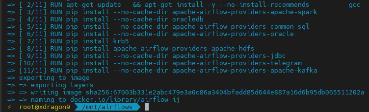
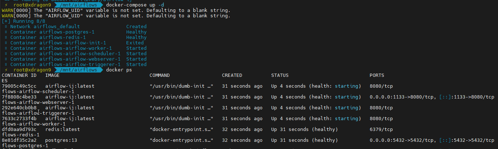

# sre_ariflow
This scripts will support for Airflow mechanism along with Spark &amp; Hadoop and Kafka

## Deploy:
```bash
$ docker build -t airflow-ij .
$ docker compose up -d
```

## Sceenshots


